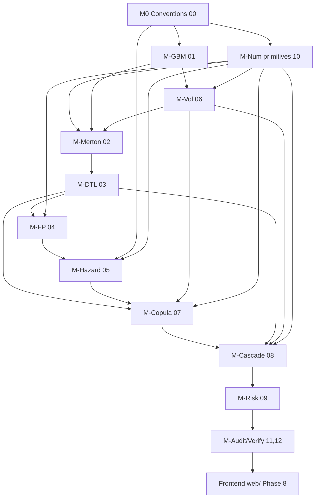

# DELTA — Execution Roadmap Overview

> Derived exclusively from the mathematical specifications in `defi/00`–`defi/12`.
> No concept, model, estimator, or numerical technique appears below unless it is
> stated in those files. Every item is tagged with the originating result ID.

This document fixes the dependency structure, module inventory, architectural
separation, and the flagged mathematical gaps that must be resolved before the
corresponding phase begins. The eight phase files (`phase_1`–`phase_8`) contain
the detailed objectives, scope, inputs/outputs, validation, and completion
criteria.

---

## 1. Decision hierarchy (governing every phase)

1. Mathematical correctness and theoretical rigor.
2. System correctness and architectural integrity.
3. Computational efficiency.
4. Developer convenience and maintainability.
5. User-facing considerations.
6. All other concerns.

Source mandate: `defi/00`–`defi/12` repeatedly assert "mathematical correctness
outranks convenience" (`defi/01` §1.6, `defi/07` §7.7, `defi/09` §9.8,
`defi/10` §10.7).

---

## 2. Mathematical module inventory

Each module maps to a single mathematical responsibility and the file that
defines it. Modules are the unit of implementation; they are grouped into phases
by theoretical prerequisite order.

| Module | Responsibility | Source | Key results |
|--------|----------------|--------|-------------|
| M0 Conventions | probability space, symbols, units, annualization | `defi/00` | §0.1–0.5 |
| M-Num Φ/Φ⁻¹ | tail-accurate normal CDF / quantile, erf/erfc | `defi/10` | N-1 |
| M-Num Special | incomplete gamma, χ², MVN/t CDF (Genz), log-space stability | `defi/10` | §10.6 |
| M-Num RNG | counter-based parallel RNG (Philox), normal-by-inversion | `defi/10` | N-3 |
| M-Num LinAlg | Cholesky, nearest-PD repair | `defi/10` | D-10.1, N-2 |
| M-GBM | GBM solution, log-return law, mean/variance, drag | `defi/01` | D-1.1…D-1.4 |
| M-Vol | RV, EWMA, GARCH(1,1)/GJR/EGARCH, MLE/QMLE, var term structure | `defi/06` | D-6.1…R-6.6 |
| M-Merton | Merton PD, distance-to-default, equity↔asset inversion | `defi/02` | D-2.1, D-2.2 |
| M-DTL | health factor, DTL, PL(T), drop-to-liq, interest-adjusted drift | `defi/03` | D-3.1, D-3.2, R-3.3 |
| M-FP | first-passage CDF, inverse-Gaussian density, defect mass | `defi/04` | D-4.1, D-4.2, R-4.3 |
| M-Hazard | survival/hazard, Cox, bootstrap, CIR, credit triangle, Poisson MLE, EVT, bridge | `defi/05` | D-5.1…R-5.7 |
| M-Copula | Sklar, one-factor model, Vasicek loss CDF, t-copula, Kendall↔ρ | `defi/07` | D-7.1…D-7.4, Thm 7.2 |
| M-Cascade | correlated sampling, price impact, cascade loop, MC LLN/CLT, variance reduction | `defi/08` | D-8.1…R-8.5 |
| M-Risk | VaR, ES, coherence, spectral, Euler allocation, estimators, backtests | `defi/09` | D-9.1…D-9.4, Thm 9.1 |
| M-Audit | derivation/notation/assumption audit, limitations ledger | `defi/11` | §A–§H |
| M-Verify | independent re-derivations, probabilistic/dimensional sweeps, ledger | `defi/12` | §A–§E |

---

## 3. Dependency graph (theoretical prerequisites)



Reading: an edge `A --> B` means B's mathematics consumes a result established by
A. Phases follow a topological order of this graph; Phase 8 (frontend) is a pure
sink that consumes engine outputs and produces no mathematics.

---

## 4. Phase ↔ file ↔ module mapping

| Phase | Files | Modules | Theme |
|-------|-------|---------|-------|
| 1 | 00, 10 | M0, M-Num (Φ/Φ⁻¹, Special, RNG, LinAlg) | Conventions & numerical primitives |
| 2 | 01, 06 | M-GBM, M-Vol | Price process & volatility input |
| 3 | 02, 03, 04 | M-Merton, M-DTL, M-FP | Structural per-position risk |
| 4 | 05 | M-Hazard | Reduced-form de-peg / term structure |
| 5 | 07 | M-Copula | Dependence structure |
| 6 | 08 | M-Cascade | Monte Carlo cascade engine |
| 7 | 09, 11, 12 | M-Risk, M-Audit, M-Verify | Risk measures & end-to-end verification |
| 8 | (dashboard flows referenced in 03 §3.5, 05 §5.8, 09 §9.5) | none (consumes only) | Presentation in `web/` |

---

## 5. Architectural separation (mandated, minimal)

Strict boundaries per the engineering constraints. No layer reaches across except
through declared inputs/outputs.

```
delta/
  defi/                      source-of-truth specifications (read-only)
  <engine>/                  mathematical engine (Phases 1-7)
    numerics/                M-Num   (Phase 1)
    conventions/             M0      (Phase 1)
    process/                 M-GBM   (Phase 2)
    volatility/              M-Vol   (Phase 2)
    structural/              M-Merton, M-DTL, M-FP (Phase 3)
    hazard/                  M-Hazard (Phase 4)
    dependence/              M-Copula (Phase 5)
    cascade/                 M-Cascade (Phase 6)
    risk/                    M-Risk  (Phase 7)
  <data>/                    data acquisition (prices, on-chain state, peg data)
  <validation>/             M-Audit, M-Verify suites (Phases 1-7)
  web/                       frontend ONLY (Phase 8) — consumes engine outputs
```

Rules enforced throughout:
- No mathematical logic in `web/` (constraint 6); the frontend renders
  precomputed engine artifacts only (constraint 7).
- Data acquisition is isolated from the engine: the engine consumes typed inputs
  (prices, returns, on-chain `C_t,B_t,ℓ,Q,P_t,r_b`, peg deviations, spreads),
  never fetches.
- Validation/verification is a separate suite mirroring `defi/11`–`defi/12`.

---

## 6. Flagged mathematical gaps, ambiguities, and missing inputs

Per the standards, every gap discovered in `defi/00`–`defi/12` is recorded here
**before** implementation planning. Each gap names the blocking phase and the
required resolution. No gap may be silently filled from outside knowledge; each
must be resolved by an explicit input contract or a documented choice traceable
to the files.

| ID | Gap / ambiguity | Where it bites | Source | Resolution required before |
|----|-----------------|----------------|--------|----------------------------|
| GAP-1 | `EAD_j` (exposure at default) is listed in notation but no file derives how it is computed per position. | scenario loss `L=Σ LGD·EAD` | `defi/00` §0.2, `defi/08` §8.2 Step 4 | Phase 6 |
| GAP-2 | Recovery `R` / `LGD=1-R` is assumed deterministic (A6) but no value or in-text estimation procedure is given (only used as an input to the credit triangle). | hazard calibration, loss aggregation | `defi/00` §0.5 A6, `defi/05` §5.5, `defi/09` | Phase 4, Phase 6 |
| GAP-3 | Price-impact parameters `η=O(1)`, daily volume `V`, and execution-window `σ` have no estimation procedure or default; `η` must be "stressed" (L-IMP) but no range is fixed. | cascade severity | `defi/08` §8.3, L-IMP | Phase 6 |
| GAP-4 | "Fire-sale slippage" is added to scenario loss but no formula links it to the impact kernel (8.2). | scenario loss | `defi/08` §8.2 Step 4 | Phase 6 |
| GAP-5 | The marginal fed to the copula default trigger `X_i<Φ⁻¹(PD_i)` is unspecified among terminal PL (D-3.1), first-passage PL (D-4.1), or hazard PD (D-5); the portfolio horizon `T` is not pinned. | dependence layer correctness | `defi/07` §7.2, `defi/08` §8.2 | Phase 5 |
| GAP-6 | The GARCH-implied return marginal `F_i` used in `r_i=F_i⁻¹(U_i)` is not fully specified (innovation law — normal vs Student-t — and multi-horizon construction). | cascade shock generation | `defi/08` §8.2, `defi/06` §6.6 | Phase 5/6 |
| GAP-7 | CIR survival is stated as `S(t)=A(t)e^{-b(t)λ₀}` with `A,b` "solving Riccati ODEs" but the explicit closed forms are not written in-text (referenced to Duffie–Pan–Singleton). | hazard term structure for stochastic intensity | `defi/05` §5.4 (D-5.4) | Phase 4 |
| GAP-8 | The "short horizon" threshold at which drift is set `μ≈0` (or `μ=r_b`) is recommended but not quantified. | DTL / first-passage drift choice | `defi/03` §3.6, `defi/06` §6.6, L-DRIFT | Phase 3 |
| GAP-9 | Assignment of positions to the `d` correlated assets and the per-asset factor loading `ρ_i` is required input; only the estimation route (Kendall τ → ρ) is given, not the asset universe. | dependence layer | `defi/07` §7.6 | Phase 5 |

Registered model limitations (not gaps — already resolved in-text and carried as
explicit caveats): L-1, L-COP, L-IMP, L-6, L-7, L-V1, L-DRIFT (`defi/11` §E).
These are documented in the relevant phases as accepted assumptions, not
re-derived.

---

## 7. Cross-cutting validation obligations

Every phase discharges the relevant rows of the `defi/11` audit and `defi/12`
verification ledgers before completion:

- Dimensional sweep (`defi/12` §C) — arguments of `exp, ln, Φ, t_ν` dimensionless.
- Probabilistic-validity sweep (`defi/12` §B) — probabilities in `[0,1]`, survival
  monotone, densities non-negative, Feller condition, ES ≥ VaR.
- Independent re-derivation (`defi/12` §A) — the result's row in the master ledger
  must reach status **verified**.
- Error budget ordering (`defi/10` §10.7) — `ε_num ≪ ε_MC ≪ ε_param`.

A phase is complete only when its results' master-ledger rows (`defi/12` §E) are
**verified** by two independent routes.
